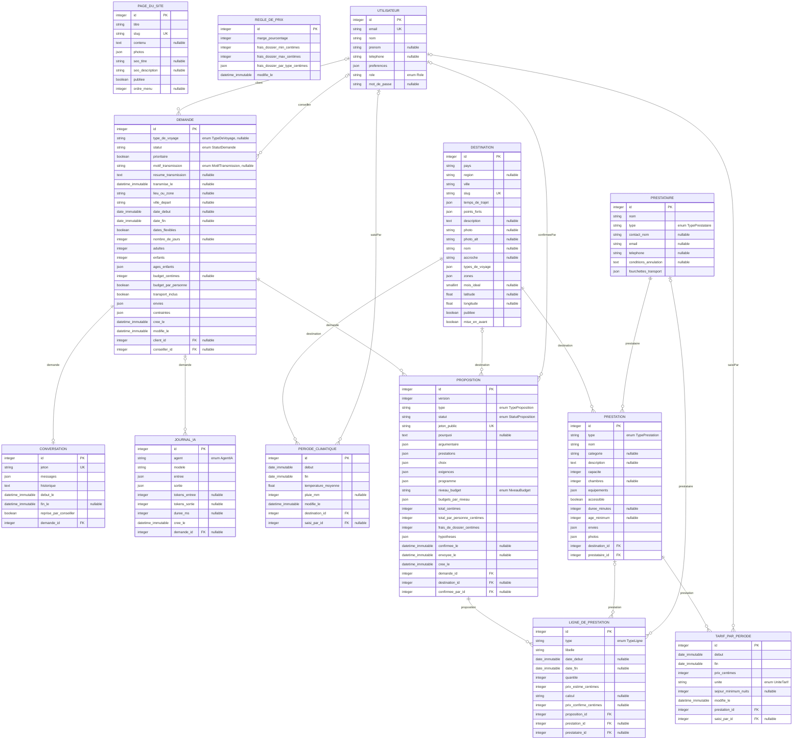

# Schéma de la base

Généré depuis le mapping Doctrine par `make schema` : ne pas modifier à la main.

```mermaid
erDiagram
    CONVERSATION {
        integer id PK
        string jeton UK
        json messages
        text historique
        datetime_immutable debut_le
        datetime_immutable fin_le "nullable"
        boolean reprise_par_conseiller
        integer demande_id FK
    }
    DEMANDE {
        integer id PK
        string type_de_voyage "enum TypeDeVoyage, nullable"
        string statut "enum StatutDemande"
        boolean prioritaire
        string motif_transmission "enum MotifTransmission, nullable"
        text resume_transmission "nullable"
        datetime_immutable transmise_le "nullable"
        string lieu_ou_zone "nullable"
        string ville_depart "nullable"
        date_immutable date_debut "nullable"
        date_immutable date_fin "nullable"
        boolean dates_flexibles
        integer nombre_de_jours "nullable"
        integer adultes
        integer enfants
        json ages_enfants
        integer budget_centimes "nullable"
        boolean budget_par_personne
        boolean transport_inclus
        json envies
        json contraintes
        datetime_immutable cree_le
        datetime_immutable modifie_le
        integer client_id FK "nullable"
        integer conseiller_id FK "nullable"
    }
    DESTINATION {
        integer id PK
        string pays
        string region "nullable"
        string ville
        string slug UK
        json temps_de_trajet
        json points_forts
        text description "nullable"
        string photo "nullable"
        string photo_alt "nullable"
        string nom "nullable"
        string accroche "nullable"
        json types_de_voyage
        json zones
        smallint mois_ideal "nullable"
        float latitude "nullable"
        float longitude "nullable"
        boolean publiee
        boolean mise_en_avant
    }
    JOURNAL_IA {
        integer id PK
        string agent "enum AgentIA"
        string modele
        json entree
        json sortie
        integer tokens_entree "nullable"
        integer tokens_sortie "nullable"
        integer duree_ms "nullable"
        datetime_immutable cree_le
        integer demande_id FK "nullable"
    }
    LIGNE_DE_PRESTATION {
        integer id PK
        string type "enum TypeLigne"
        string libelle
        date_immutable date_debut "nullable"
        date_immutable date_fin "nullable"
        integer quantite
        integer prix_estime_centimes
        string calcul "nullable"
        integer prix_confirme_centimes "nullable"
        integer proposition_id FK
        integer prestation_id FK "nullable"
        integer prestataire_id FK "nullable"
    }
    PAGE_DU_SITE {
        integer id PK
        string titre
        string slug UK
        text contenu "nullable"
        json photos
        string seo_titre "nullable"
        string seo_description "nullable"
        boolean publiee
        integer ordre_menu "nullable"
    }
    PERIODE_CLIMATIQUE {
        integer id PK
        date_immutable debut
        date_immutable fin
        float temperature_moyenne
        integer pluie_mm "nullable"
        datetime_immutable modifie_le
        integer destination_id FK
        integer saisi_par_id FK "nullable"
    }
    PRESTATAIRE {
        integer id PK
        string nom
        string type "enum TypePrestataire"
        string contact_nom "nullable"
        string email "nullable"
        string telephone "nullable"
        text conditions_annulation "nullable"
        json fourchettes_transport
    }
    PRESTATION {
        integer id PK
        string type "enum TypePrestation"
        string nom
        string categorie "nullable"
        text description "nullable"
        integer capacite
        integer chambres "nullable"
        json equipements
        boolean accessible
        integer duree_minutes "nullable"
        integer age_minimum "nullable"
        json envies
        json photos
        integer destination_id FK
        integer prestataire_id FK
    }
    PROPOSITION {
        integer id PK
        integer version
        string type "enum TypeProposition"
        string statut "enum StatutProposition"
        string jeton_public UK
        text pourquoi "nullable"
        json argumentaire
        json prestations
        json choix
        json exigences
        json programme
        string niveau_budget "enum NiveauBudget"
        json budgets_par_niveau
        integer total_centimes
        integer total_par_personne_centimes
        integer frais_de_dossier_centimes
        json hypotheses
        datetime_immutable confirmee_le "nullable"
        datetime_immutable envoyee_le "nullable"
        datetime_immutable cree_le
        integer demande_id FK
        integer destination_id FK "nullable"
        integer confirmee_par_id FK "nullable"
    }
    REGLE_DE_PRIX {
        integer id PK
        integer marge_pourcentage
        integer frais_dossier_min_centimes
        integer frais_dossier_max_centimes
        json frais_dossier_par_type_centimes
        datetime_immutable modifie_le
    }
    TARIF_PAR_PERIODE {
        integer id PK
        date_immutable debut
        date_immutable fin
        integer prix_centimes
        string unite "enum UniteTarif"
        integer sejour_minimum_nuits "nullable"
        datetime_immutable modifie_le
        integer prestation_id FK
        integer saisi_par_id FK "nullable"
    }
    UTILISATEUR {
        integer id PK
        string email UK
        string nom
        string prenom "nullable"
        string telephone "nullable"
        json preferences
        string role "enum Role"
        string mot_de_passe "nullable"
    }
    DEMANDE ||--o| CONVERSATION : demande
    UTILISATEUR |o--o{ DEMANDE : client
    UTILISATEUR |o--o{ DEMANDE : conseiller
    DEMANDE |o--o{ JOURNAL_IA : demande
    PROPOSITION ||--o{ LIGNE_DE_PRESTATION : proposition
    PRESTATION |o--o{ LIGNE_DE_PRESTATION : prestation
    PRESTATAIRE |o--o{ LIGNE_DE_PRESTATION : prestataire
    DESTINATION ||--o{ PERIODE_CLIMATIQUE : destination
    UTILISATEUR |o--o{ PERIODE_CLIMATIQUE : saisiPar
    DESTINATION ||--o{ PRESTATION : destination
    PRESTATAIRE ||--o{ PRESTATION : prestataire
    DEMANDE ||--o{ PROPOSITION : demande
    DESTINATION |o--o{ PROPOSITION : destination
    UTILISATEUR |o--o{ PROPOSITION : confirmeePar
    PRESTATION ||--o{ TARIF_PAR_PERIODE : prestation
    UTILISATEUR |o--o{ TARIF_PAR_PERIODE : saisiPar
```
